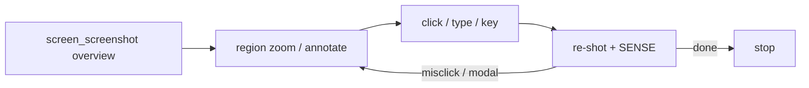

# Tool loop

Desktop control is a **loop**, not a single call:

```text
locate  →  ground  →  act  →  confirm
```

The bundled `drive-screen` skill encodes the same loop for Claude Code. This page is the human-readable version.

## The efficient loop

1. **Locate (once)** — `screen_screenshot()` with no args = full multi-monitor overview. Use it only to find *where* the target is and which monitor. Do not loop on the full composite.
2. **Ground** — `screen_screenshot(region=[x,y,w,h])` for a crisp zoom, and/or `annotate=true` for numbered Set-of-Marks with click coordinates. Small region shots are fastest and sharpest.
3. **Act** — `screen_click` / `screen_type` / `screen_key` / `screen_scroll` / `screen_drag`. Default `space=view` uses coordinates as seen in the **latest** screenshot. Prefer `element=<id>` from the last annotated shot so the server resolves exact coords.
4. **Confirm** — take another screenshot. After an action, capture **auto-settles** (waits for the UI to stop repainting). Read the **`SENSE`** line: new elements, modal opened, or "nothing changed" = no-op/misclick → re-ground and retry.



## Shared action knobs

Most mutating tools accept the same optional args (see `server.py` shared schema):

| Arg | Role |
|---|---|
| `space` | `view` (default) = last-screenshot pixels; `desktop` = global native px; `norm` = 0–1000 |
| `view_id` | Bind view-space coords to the `view#N` they came from; rejects stale transforms |
| `element` | Click element id from last `annotate=true` (server resolves coords) |
| `focus` | Raise + keyboard-focus an app/window **before** the action |
| `shot` | Return a screenshot after the action |
| `verify` | Warn if the screen did not change (misclick detector) |
| `force` | Bypass user-takeover guard / reclaim after `STOPPED` |
| `region` / `monitor` | Crop or target geometry for post-shots / settle |
| `settle` | Settle budget; `0` = instantaneous cached frame |

## Annotate (Set-of-Marks)

```text
screen_screenshot(annotate=true, region=[…])   # optional use_cache=true
screen_click(element=12)                       # or use desktop(x,y) from the overlay text
```

- OmniParser (YOLOv8 ONNX) finds interactable regions.
- RapidOCR reads text; labels fuse text into mark names.
- `use_cache=true` reuses the world-model cache for a known screen (skips OCR).
- Without the ONNX model, a classical OpenCV contour path is the fallback.

For the model-selection rationale, see [Grounding research](v1.1-grounding-research.md).

## Focus before type / key

Keyboard events go to the **focused** window — not the window you are looking at.

| Method | When |
|---|---|
| **Click-to-focus** | Universal: `screen_click` into the target content area, then type |
| `screen_focus(app=…)` / `title` / `id` | Raise + focus by name when you cannot click it yet |
| `focus=` on `screen_type` / `screen_key` | Same raise+focus inline before the keystroke |

`screen_focus` uses the window-info GNOME extension when loaded; otherwise overview search. Overview may raise without reliable keyboard focus on multi-monitor static setups — fall back to click-to-focus.

## Coordinate rules (the #1 failure mode)

Every screenshot stamps a `view#N` and maps view-space coords through that shot's origin/scale. **One** transform slot is overwritten by every new screenshot.

!!! warning "Coords belong to ONE screenshot"
    Coords from `view#7` are only valid until the next shot rebinds the view. Applying them after `view#8` can land on the wrong monitor.

Rules:

1. **Screenshot → read coords → click**, with no other screenshot in between when possible.
2. Or pass **`view_id=N`** so a superseded view raises `STALE VIEW` instead of missing.
3. Or use **`space=desktop`** / **`element=`** (absolute desktop px — transform-independent).

The pixel mapping is 1:1 when the view is current. A "miss" is almost always a stale view, not the app rejecting the click.

## Speed rules

- **Region-first.** Region shots are ~100–300 ms and sharp; full composite is slower and downscaled.
- **Trust auto-settle.** Do not add manual waits after every action before screenshotting. Use `screen_wait` only for async UI that keeps changing after settle would finish.
- **`screen_read_page`** for long scrollable content in one call.
- **`screen_do`** to batch known multi-step sequences.
- **`screen_tour`** to survey several UI states with labeled thumbnails.
- **`screen_diag` first** when capture, clicks, or the cursor guard misbehave.

## Monitor frames (GNOME damage)

GNOME streams a monitor only on **damage**. An ON-but-STATIC idle monitor may yield no new frame until something changes.

| Situation | What to do |
|---|---|
| ON but STATIC | One interaction on that monitor (`scroll` a notch, or click something that repaints), then screenshot |
| Cold pipeline after reload | `screen_screenshot(regeo=true)` |
| Genuinely DPMS / asleep | Ask the human to wake it — the agent cannot wake a powered-off panel |
| Static read looks stale | `fresh=true` on screenshot (nudges the pointer once) |

## Honesty boundary

Report what is actually on screen. If the target app is not visible, the monitor is asleep, or a view will not navigate, say so and ask the human for the physical action only they can do. Do not invent content.
